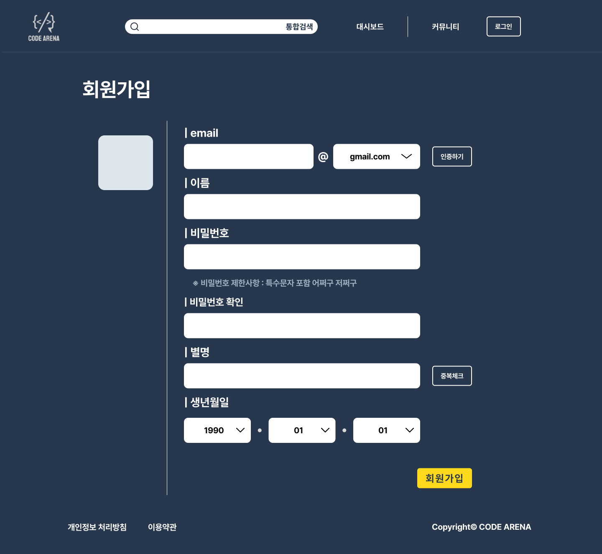

# Component 분리에 대한 고민

Form 태그의 각 항목을 component로 분리하려 했는데,

1. 버튼의 유무
2. 고정 메시지의 유무 (ex. 비밀번호 제한사항)
3. 초록 / 빨간 메시지 (approve / reject 신호에 따른)의 렌더링
4. input 태그의 길이 css (email의 경우 각각의 input과 select 가 서로 다른 길이를 가짐)

의 props를 모두 받을 수 있는 컴포넌트를 만들어야 하는가? 에 대한 고민이 들었음

## 결론

1. 너무 복잡한 component 구성은 협업을 더 어렵게 함
2. 버튼 (인증하기, 중복체크)을 눌렀을 때 단순히 초록 / 빨간 메시지만 렌더링 해야 하는데, 전체를 컴포넌트로 묶고 useState를 선언해 boolean 변수를 버튼으로 받은 response에 따라 변경할 경우 전체 컴포넌트가 재렌더링될 것이므로, 비효율적임
3. 버튼과 메시지만을 연동해서 재렌더링 시키는 것이 좋을 듯
