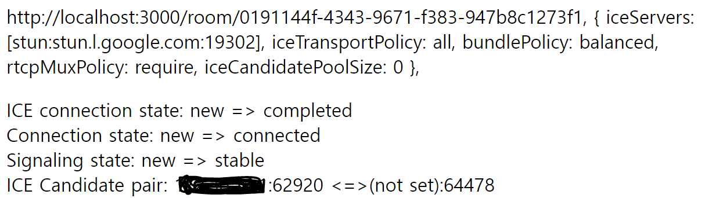

# WebRTC 구현

라이브 코딩 테스트 대비를 위한 서비스를 기획하면서, 가장 필수적인 기능이 바로 "화상 채팅" 기능이었다.

동시에 데이터를 주고 받아야 하니, 웹소켓처럼 Request를 날리지 않아도 Response가 와야 했다. 즉, Stateless를 극복해야 하는 근본적인 문제가 있었다.

해답은 서버를 통하는 것이 아닌, 브라우저와 브라우저가 직접적으로 연결하는 기술인 WebRTC에 있었다.  
더 정확히는, Kurento가 미디어 서버로서 비디오, 오디오 데이터를 중개해주었다.

그 과정에서 서버는 브라우저와 브라우저가 네트워크 상에서 서로를 특정할 수 있기 위한 발판인 시그널링만을 수행해주고, 더 이상 관여하지 않는다.
이 시그널링 과정에 관여하는 것이 바로 ICE candidate 인데, 상대와 내가 연결되는 여러가지 자원과 그 방식을 의미한다.  
RTC Peer 들은 sdp 를 offer 와 answer 의 형태로 Ice candidate에 담아서 주고 받고, 성공적으로 시그널링이 수행되고 나면, RTC Peer Connection이 체결된다.
이 과정에서 Receive만, 혹은 Send만 하거나, RecvSend 를 모두 하는 WebRtcPeer 객체를 사용자가 정해 생성할 수 있다.

#### STUN server 와 TURN server

TURN server는 STUN server의 특정한 경우로, 브라우저와 브라우저가 직접 통신이 불가능 하다면, TURN Server를 통해 미디어스트림을 주고 받는 일종의 차선책이다.
그 이전에 STUN server는 NAT 바깥에서 자신으로의 접근 방법을 확인하는 용도로 쓰이는데,

> 모 게시물들 중에서는 로컬 환경. 즉, 같은 IP 내에서는 TURN 서버 적용이 불가피하다는 언급이 있었는데, 구현에 성공하고 보니, 없이도 잘 돌아가는 것이 확인되어 당황스러웠다.  
> 다만, 배포 단계에 들어서면 네트워크라는 큰 변수가 등장하니, docker-compose 파일에 적은 TURN 서버는 지우지 않고 남겨 놓았다.

//

이 정도 이해했으면, 이제 직접 Kurento 의 공식 tutorial 문서를 보면서 적용해보는 일만 남았다.
더 자세히 공부해서 이론의 end-to-end를 꼭꼭 씹어가며 구현하기에는, 다른 프론트 팀원들이 내가 만든 페이지의 자잘한 event와 api 작성까지 대신 해주고 있는 상황이었기에
무리인 감이 있었다.

물론, 그런 어설픈 이해로 달려들었기에 중간에 코드를 새로 짜면서 7주 프로젝트에 1주를 쏟아야 했을지도 모르겠다.

## Tutorial 읽고 이해하기

처음 내게 주어진 것은, [Kurento 공식 tutorial - GroupCall] 이었다. 그 안에는 Java코드와 바닐라 HTML, CSS, JS 코드가 있었다. Java 파트와 Kurento media server를 띄우는 일 등은 백엔드 팀원이 담당하고, 브라우저에서 서버에 시그널링을 요청하고, 화면에 상대편 영상을 띄우는 일은 내가 담당하였다.

사실 이전에 백엔드 팀원이 해당 프론트 코드를 그대로 써서 구현(서로의 동영상이 뜨는 것)에 성공한 것을 보여주었기 때문에 빠르게 발을 맞추고자 바로 코드를 읽어나가기 시작했다. 프로젝트 2, 3 주차에 필수적인 용어(RTC, WebSocket)와 이론에 대한 공부를 틈날 때마다 해놓았기 때문에 가능한 일이었다.

형태는 사실, 초기 Spring 과 JSP 를 공부할 때 했던 것과 비슷했다. 클라이언트가 웹소켓을 요청하고, 웹소켓이 서버와 연결되면 메시지에 id key를 가진 객체를 담아 서로 주고받기 시작한다. 이 메시지에 담긴 id의 값이 "join"이냐, "iceCandidate"이냐에 따라 로직을 구성해 분기처리하는 것이 기본적인 구조였다.

최초에 사용자가 방에 들어오자마자 방의 정보를 담아 서버로 register 요청을 보내고, 서버는 해당 room 에 이미 존재했던 WebCamSession의 사용자들에게 모두 새로운 사용자가 등장했다는 것을 알린다. 역으로 새롭게 등장한 사용자에게는 이미 room에 존재했던 모든 사용자의 목록을 준다.

이때 받은 것들을 가지고, 이미 존재했던 사용자들은 WebRTCPeerRecvOnly 객체를 하나 추가로 생성해 새로운 사용자의 WebRTcPeerSendOnly 객체와 연결을 시도하는 것이 기본 틀이다. 당연히 새로운 사용자는 SendOnly 객체 하나, 이미 존재했던 모든 사용자의 RecvOnly객체를 생성해야만 한다.

> 즉, 방에 들어온 사용자 중에 자기자신은 SendOnly, 나머지는 모두 RecvOnly로 생성한다.

해당 WebRTCPeer 객체에 sdpOffer와 sdpAnswer를 생성하고, peerConnection을 체결하는 모든 함수가 내장되어 있기 떄문에 그 이후로는 하나씩 tutorial에 맞춰 해나가면 되는 일이었다.

## JS, HTML, CSS -> TS, React

문제는, 그 코드가 모두 바닐라 자바스크립트, html 코드로 쓰여져 있었다는 점이다. 당연하게도 JS 파일에서는 직접 DOM에 접근해 화면을 재렌더링 및 연결하고 있었고 nested 객체를 생성하고, 값을 읽는 데에 아무런 제약이 없는 상태였다.

우리 프로젝트에서는 React와 TypeScript, Next.js를 사용하고 있었기 때문에 (심지어 모두 해당 프로젝트에서 처음 시작하는 단계였다.) 특히 DOM에 직접 접근하는 부분을 React 코드로 고치는 것이 가장 막막하였다.

### 타입 지정

처음에는 모든 타입을 검색해가면서, 그리고 마우스를 호버해 알아내면서 코드를 작성하기 시작했다.

가장 먼저 kurento-utils 함수와 객체들의 타입을 지정해야 했는데, 다행히도 npm이 존재해서 다운 받았지만 그것을 어떻게 설정하는지, 설정이 잘 된건지도 몰라서 한참 애를 먹었다.

이것이 초반 패착의 이유 중 하나였다. 에러가 반복해서 터지는데, 그것이 타입 때문인지, React 문법 떄문인지를 특정하기가 힘들어 고친 코드를 원복했다가 다시 고치기 일쑤였다. 급한 마음에 ( as any)를 남발했는데, 그러다 보니 Undefined 에러가 떴을 때 더욱 막막해졌다.

### 컴포넌트 (클래스 컴포넌트) 분리

해당 코드에서는 새로운 사용자가 등장했을 때, 이를 participants라는 **객체를 담는 객체**로 관리하고 있었다. 문법에 익숙하지 않았던 나는 그냥 익숙한 객체 배열로 바꿔보기로 마음 먹었다. 그리고, Participant 클래스 컴포넌트를 만들어서 해당 클래스를 이용해 객체도 만들고, map을 돌려 컴포넌트 렌더링까지 하는 큰 꿈을 꾸었다.

지금 생각해보면 객체는 자바로 치면 해시맵인지라, 원하는 유저의 필드를 바로 접근해 더 손쉽게 바꿀 수 있는데, 배열은 배열을 순회하면서 내가 원하는 사용자 (id로 구분)가 맞는지 체크하는 조건문이 있어야 한다. 굳이 익숙한 방식을 고집하다가 더한 비효율을 떠안는 꼴이었다.

> 기본적인 문법과 언어에 대한 문제에 직면하면, 두려워 말고 잠시 공부를 더 해서 확실히 알고 돌아오는게 더 빠른 방법이라는 것을 알게 되었다.

결과적으로, participant 객체에 WebRtcPeer 객체를 담고, 그 WebRtcPeer들 끼리 서로 연결하는 과정에서 말도 안되게 에러가 많이 발생했다. 후에 근본적인 문제였던 React의 useState 렌더링 타이밍과 완전히 이해하지 못했던 useEffect 훅, 클래스 컴포넌트에서는 훅을 쓸 수 없다는 점 등이 겹치며 어디서부터 손을 대야 할지 모르는 상태가 되었다.

//

---

여기까지가 내 기억이 맞다면, 월요일부터 목요일까지의 일이다. React, Kurento, TypeScript, WebRTC 어느 것하나 제대로 아는 것이 없는 상태로 시작했다. 튜토리얼의 코드 한 줄 한 줄 부딪치며 배워나가는 과정이 내 코드에 모두 들어 있게 됐는데, 더 이상 디버깅 할 수가 없는 수준이었기에 과감하게 다시 처음부터 코드를 쓰기로 마음 먹었다. 백엔드와의 통신과정 로직과 React에서 주의해야 할 점이 그제서야 이해가 되었기 때문에 전체 Tutorial 코드를 한번에 이식하기 보다는, 각 단계 별로 하나씩 함수를 작성해나가면서 유닛 테스트 느낌으로 코드를 작성하기로 하였다.

그 과정에서 sendMessage 같이 반복되지만 "간단한" 함수는 되도록 디버깅의 수고를 줄이기 위해 따로 작성하지 않고, 실행되는 함수내에서 직접 타이핑해 작성하였다.

#### Chat GPT를 썼다!

AI를 좋아하는 사람으로서 chatGPT가 아는 것은 결국 인류의 누군가는 알고 있는 것이라고 생각해 chatGPT보다는 구글의 검색능력과 사람이 쓴 공식문서를 찾았던 내가 Chat GPT를 쓰게 된 것은,

인류의 누군가는 알고 있지만, 지금 **나** 는 React에 대해 전혀 모른다는 것을 인정했기 때문이다. 그리고 내가 정한 데드라인이 다가오고 있기 때문도 있었다.

빠르게 GPT의 코드를 받아본 다음, 내가 이해한 WebRTC의 로직과 일치하면 React 문법에 대한 검토는 GPT에게 맡기는 식으로 진행해 나갔다.

> 결과적으로 GPT에 대한 인식이 조금은 바뀌었다.

---

//

## useState의 rendering 타이밍과 useEffect, 그리고 전역변수 설정

useState를 이전에는 상태가 변화면 -> 렌더링이 일어난다는 단순한 의미로 이해했었다. 그런데, 문제가 발생하고 있는 것 같아서 찾아보고 공부해보니, State 변화를 누적해놓고 있다가 한번에 렌더링이 일어난다는 것을 알았다.

사실 얼핏 들어서 알고 있었던 내용이었지만, 직접 코드를 치면서 해당 부분을 고려해 코드를 한번에 짜내는 것이 아직은 어려웠던 것 같다.

이때 사실 최종 구현의 열쇠에 대한 생각을 되게 일찍 했었는데, 바로 "그러면, DOM에 직접 접근했던 JS 코드를 렌더링 이전에 수행돼야 하는 부분과 이후에 수행하는 부분으로 쪼개야하나?" 라는 생각이었다.

떠오른 생각을 좀 더 과감하게 수행하지 못했던 것도 돌이켜 보면, React 문법에 대한 확신이 없었기 때문이었다.

---

ChatGPT는 remoteVideos 상태와 webRtcPeers 상태를 둘 다 객체를 담는 객체로 생성하라고 코드를 짜주었다.

결과적으로 나는 webRtcPeers는 globalWebRtcPeers로 전역변수 설정을 하였고, remoteVideos는 useState훅을 써서 상태관리를 하는 대신에, remoteVideos에 접근한 코드를 useEffect 훅을 써서 둘로 쪼개었다.

둘의 차이는 내부적으로 createRef()로 생성한 객체를 사용하느냐 마느냐였는데, remoteVideos의 변화로 렌더링된 video 태그를 Ref에 꽂은 상태로 WebRtcPeer의 remoteVideo Configuration에 넘겨 주어야 했기에 useEffect훅을 써야만 했다.

## 백엔드 코드 읽고 이해하면서 디버깅

코드를 유닛테스트 느낌으로 한단계 씩 구현하다보니 서버에 내가 보낸 메시지가 잘 왔는지 확인하고 싶어 Sysout을 찍어가면서 진행했다. 처음에는 gradle 프로젝트와 Docker로 띄운 서버는 뭔가 다른가 싶어 Sysout을 찍으면 안나오는 줄 알았고, 실제로 Sysout이 안찍히기도 해서 진짜 그런 줄 알았는데, 그냥 내 코드가 잘못돼서 함수가 작동을 안하고 있는 거였다.

결과적으로 WebCamSession 을 찾는 과정에서 Id가 sender와 receiver 것이 있는데, 서로 바꾸어 작성된 부분들이 있어 수정하였다. 단계 별로 어떤 함수와 로직이 수행되어야 하는지가 이해됐기 때문에 이런 수정이 가능해졌던 것 같다.

## WebSocket closed

중간에 웹소켓이 이미 닫혀 있어 메시지를 보낼 수 없다는 에러가 자꾸 떴었는데, 그떄는 이유를 찾지 못했었다.
알고보니, 테스트를 위해 창을 새로고침하면 사용자의 접속이 끊긴다. 이때 사용자가 떠나는 이벤트를 작성해야 하는데, 단계별로 진행하다 보니 마지막 Leave단계를 작성하지 않아서, handling 되지 않은 에러가 터지면서 웹소켓이 닫히는 것이었다.

어쨌든 나가기 전까지의 로직도 제대로 수행되고 있지 않은 것이었기에, 현재 단계에서 일어난 에러는 아니라고 생각하고 무시하고 진행하였다.

### onIcecandidate 이벤트 트리거 발동 안함

새로운 iceCandidate 이 추가되면, onIceCandidate 이벤트 트리거가 발동해서, 클라이언트에게 iceCandidate 메시지를 쏴주어야 한다.

근데 이것이 작동하지 않아서 찾아보았다.

[2023년..](https://groups.google.com/g/kurento/c/czgdrMqJN5A)

다음의 코드를 build.gradle 파일에 추가했다.

```gradle
tasks.named('bootRun') {
	doFirst {
		jvmArgs = [
				'--add-exports=java.base/sun.reflect.generics.reflectiveObjects=ALL-UNNAMED'
		]
	}
//	useJUnitPlatform()
}
test {
	useJUnitPlatform()
	jvmArgs = [
			'--add-exports=java.base/sun.reflect.generics.reflectiveObjects=ALL-UNNAMED'
	]
}
```

## WebRTC-internals와 IP address

webRTCPeerConnection이 체결되었는지 아닌지가 매번 궁금한데 눈으로 확인할 수가 없어 답답하던 시기에 다음의 브라우저 제공 툴을 찾아내었다.

chrome://webrtc-internals/

해당 툴을 돌아보다 보니



위와 같이 상대편 IP 주소가 not-set으로 되어 있는 것을 보게 되었다.

IP주소를 못찾고 있는 건가? 싶어 로그를 찍어보았더니 또 Offer와 Answer 메시지에는 잘 찍히고 있었다.

찾아보다 보니 Chrome 정책중에 IP 주소를 WebRTC 상에서 mDNS로 가리는 것도 있다 길래 불안해져서 WebRTC 객체 생성시에 IP를 하드코딩해 보았지만, 여전히 not-set으로 되어 있었고,  
원래 Kurento tutorial에서도 IP를 설정해주진 않았기 때문에 해당 문제가 아니라고 생각했다.

## dataChannel

webRTCPeer의 공식 MDN 문서를 뒤지다보니, dataChannel 이 있고, 여러 종류의 데이터가 오고 갈 수 있다는 것을 알게 되었다. 이에 또다시 WebRTCPeer 생성시에 configuration을 건드려 dataChannel을 생성하게 했고, 셍성된 객체에서 dataChannel이 undefined 였던 것이 제대로 생성되는 것을 보았다.
그러나 해당 dataChannel의 경우 연결과정에서 작동하는 Event를 모두 정의해 주어야 한다는 것까지 알게 돼서 이 문제가 아닐 것 같다고 느꼈다.

또, WebRTC-internals에서 송수신되고 있는 media 데이터에 대한 것을 실시간으로 볼 수 있었는데, 노트북에 대고 소리를 지르니 해당 데이터의 peek가 솟는 것을 보고 "아, 데이터는 잘 가고 있구나"를 느꼈기 떄문에 더욱더 dataChannel문제는 아니라는 것을 알았다.

## 최종 결과

가장 위에 기술했듯이, 결국 원인은 videoRef가 webRTCRecvOnly 객체의 remoteVideo에 꽂힐 떄 아직 렌더링되지 않은 상태여서 null로 들어가기 때문이었다. (~~항상 끝은 허무하다~~) (undefined가 아니라 null 이라는 점이 또 하나의 힌트가 되었다.)

이를 해결하기 위해 useEffect훅으로 렌더링 이후에 WebRTCPeer를 생성하는 것으로 옮기니 정상적으로 영상이 수신되었다.

[OpenVidu]: (https://openvidu.io/)
[Kurento 공식 tutorial - GroupCall]: (https://github.com/Kurento/kurento-tutorial-java)
