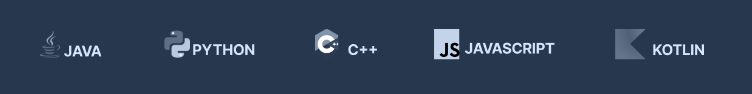
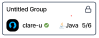

# ProgramLang-component

- code-arena 프로젝트를 하면서 당차게 내가 이거 컴포넌트로 만들어볼게! 하고 당차게 시작했으나, 결국 사용된 모든 곳에서 애만 먹이는 컴포넌트를 내 손으로 만든 꼴이 되고 말았다.

- 해당 컴포넌트는 다음과 같이 쓰인다.

포함해야 하는 특성은 다음과 같았다.

- 프로그래밍 언어
- 프로그래밍 언어 이미지

### 문제 발생

언어의 입력값, 만약 자바라면 "JAVA", "Java", "java" 등을 모두 구분하게 만들어야 했다.

후에 타입스크립트 정의에서 가질 수 있는 값을 제한시켜 줄 수 있다는 것을 알았지만, 해당 컴포넌트를 만들 당시에는 string 같이 자료형만 지정해줄 수 있는 줄 알았다. 때문에 협업하는 팀원들이 누구는 "java", "JAVA"와 같이 서로 다른 입력을 넣었고, 이미지가 제대로 불러와지지 않는 문제가 생겼다.

### Props

내가 생각했던 것보다 넘겨주어야 하는 Props가 굉장히 많았다. 글자 자체부터 ("PYTHON", "Python") 글씨 크기, 색깔까지. 이미지 크기와 비율, 이미지와 글씨 사이의 간격. 전체 컴포넌트의 크기 등 생각해야 할 것이 한 두개가 아니었는데 작업이 바빠지다 보니 해당 컴포넌트를 수정하는 일이 순위에서 밀려 결국 결과물에서는 엉망진창인 컴포넌트가 되어버렸다.
